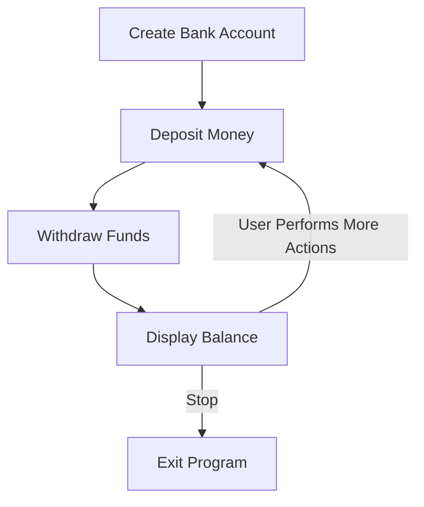

# Bank System by Jo Foundation — Explanation

## Overview

This project implements a **simple Bank Account System** using Python and Object-Oriented Programming (OOP). It simulates basic banking features such as depositing, withdrawing, and checking account balances.

The main goal of this project is to demonstrate OOP concepts through a real-world example while keeping the code clean, modular, and easy to expand.

---

## Key Concepts & OOP Implementation

| Concept               | Where Used                                       | Explanation                                 |
| --------------------- | ------------------------------------------------ | ------------------------------------------- |
| **Class**             | `BankAccount`                                    | Represents a blueprint for bank accounts    |
| **Object / Instance** | Any created bank account                         | Each account has its own name + balance     |
| **Encapsulation**     | Private-like handling of balance through methods | Balance only modified using class functions |
| **Methods**           | `deposit()`, `withdraw()`, `display_balance()`   | Perform banking actions                     |

---

## Code Structure Explanation

### Class Definition

The `BankAccount` class defines two essential properties:

* **Account Holder Name**
* **Account Balance**

```python
class BankAccount:
    def __init__(self, owner, balance=0):
        self.owner = owner
        self.balance = balance
```

Purpose:

* Initializes every new bank account with a default starting balance of **0** unless specified.

---

### Deposit Function

```python
def deposit(self, amount):
    if amount > 0:
        self.balance += amount
        print(f"Deposit successful! New balance: ${self.balance}")
    else:
        print("Invalid deposit amount!")
```

Purpose:

* Adds money into the account
* Includes **input validation** to prevent negative deposits

---

### Withdraw Function

```python
def withdraw(self, amount):
    if amount <= self.balance and amount > 0:
        self.balance -= amount
        print(f"Withdrawal successful! New balance: ${self.balance}")
    else:
        print("Insufficient funds or invalid amount!")
```

Purpose:

* Prevents the balance from going negative
* Rejects invalid withdrawal amounts

---

### Display Balance

```python
def display_balance(self):
    print(f"{self.owner}'s account balance: ${self.balance}")
```

Purpose:

* Shows latest balance for the account

---

## Program Workflow



The user interacts step-by-step with account operations until they decide to exit.

---

## Purpose of the Project

* Practice **Python fundamentals**
* Showcase **OOP principles** clearly
* Build a **realistic system** that can grow into:

  * Multiple accounts database
  * Login & authentication
  * Banking transaction history

This project is a solid foundation for more advanced data science or backend development projects.

---

## Summary

| Feature              | Status |
| -------------------- | :----: |
| Deposit              |    ✅   |
| Withdraw             |    ✅   |
| Display Balance      |    ✅   |
| OOP Concepts Applied |  ✅ ✅ ✅ |

This system is simple but expandable, making it an ideal **GitHub final project** to demonstrate Python OOP skills.

---

Feel free to extend the system later with:
✅ Multiple user accounts
✅ Error handling improvements
✅ Data persistence using files or databases
